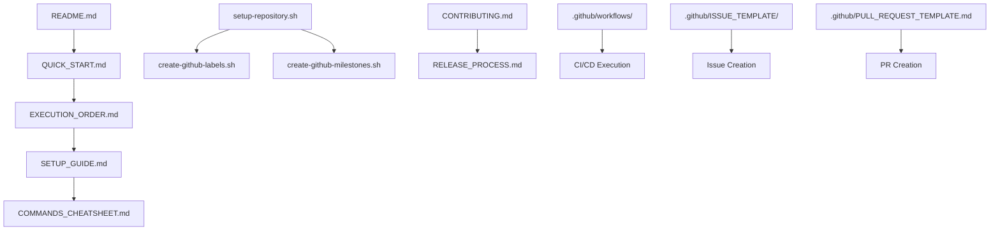

# 📁 Project Files Index

Complete index of all configuration and documentation files created for the Jewellery Tag Intelligence Platform.

## 🗂️ Repository Structure

```
jewellery-tag-intelligence-platform/
├── .github/
│   ├── workflows/
│   │   ├── frontend-ci.yml          # Frontend CI/CD pipeline
│   │   └── backend-ci.yml           # Backend CI/CD pipeline
│   ├── ISSUE_TEMPLATE/
│   │   ├── bug_report.md            # Bug report template
│   │   ├── feature_request.md       # Feature request template
│   │   ├── technical_task.md        # Technical task template
│   │   └── config.yml               # Issue template configuration
│   ├── PULL_REQUEST_TEMPLATE.md     # Pull request template
│   └── CODEOWNERS                   # Code ownership rules
├── frontend/                         # React Native application
├── backend/                          # Node.js API server
├── docs/                            # Project documentation
│   ├── apicontract.md               # API documentation
│   └── prompt.md                    # Project prompt
├── .gitignore                       # Git ignore rules
├── README.md                        # Project README
├── SETUP_GUIDE.md                   # Comprehensive setup guide
├── QUICK_START.md                   # Quick start guide
├── EXECUTION_ORDER.md               # Step-by-step execution order
├── COMMANDS_CHEATSHEET.md           # Git commands reference
├── CONTRIBUTING.md                  # Contribution guidelines
├── RELEASE_PROCESS.md               # Release workflow
├── PROJECT_FILES_INDEX.md           # This file
├── setup-repository.sh              # Automated setup script
├── create-github-labels.sh          # Labels creation script
└── create-github-milestones.sh      # Milestones creation script
```

---

## 📄 File Descriptions

### GitHub Workflows

#### `.github/workflows/frontend-ci.yml`
- **Purpose:** CI/CD pipeline for frontend
- **Triggers:** Push/PR to main or develop (frontend changes)
- **Actions:**
  - Install dependencies
  - Run linter
  - Build application
  - Upload build artifacts

#### `.github/workflows/backend-ci.yml`
- **Purpose:** CI/CD pipeline for backend
- **Triggers:** Push/PR to main or develop (backend changes)
- **Actions:**
  - Install dependencies
  - Run linter
  - Run tests
  - Upload coverage reports

### Issue Templates

#### `.github/ISSUE_TEMPLATE/bug_report.md`
- **Purpose:** Template for reporting bugs
- **Sections:**
  - Bug description
  - Steps to reproduce
  - Expected vs actual behavior
  - Environment details
  - Error logs
  - Priority level

#### `.github/ISSUE_TEMPLATE/feature_request.md`
- **Purpose:** Template for requesting features
- **Sections:**
  - Feature description
  - Problem statement
  - Proposed solution
  - User story
  - Acceptance criteria
  - Priority and milestone

#### `.github/ISSUE_TEMPLATE/technical_task.md`
- **Purpose:** Template for technical tasks
- **Sections:**
  - Task description
  - Technical requirements
  - Implementation details
  - Testing strategy
  - Effort estimation

#### `.github/ISSUE_TEMPLATE/config.yml`
- **Purpose:** Issue template configuration
- **Features:**
  - Disables blank issues
  - Links to discussions
  - Links to documentation

### Pull Request Template

#### `.github/PULL_REQUEST_TEMPLATE.md`
- **Purpose:** Standardized PR format
- **Sections:**
  - Summary of changes
  - Type of change
  - Related issues
  - Screenshots
  - Testing performed
  - Quality checklist
  - Security checklist

### Code Ownership

#### `.github/CODEOWNERS`
- **Purpose:** Automatic reviewer assignment
- **Ownership:**
  - Frontend → @anamika @divyanshkotnala
  - Backend → @ishika @divyanshkotnala
  - Docs → @divyanshkotnala
  - CI/CD → @divyanshkotnala

### Configuration Files

#### `.gitignore`
- **Purpose:** Exclude files from Git
- **Exclusions:**
  - Dependencies (node_modules)
  - Environment variables (.env)
  - Build outputs (dist, build)
  - Logs and uploads
  - IDE settings
  - OS files

### Documentation Files

#### `README.md`
- **Purpose:** Project overview
- **Contents:**
  - Project description
  - Team information
  - Quick start guide
  - Branch strategy
  - Milestones overview
  - CI/CD information
  - Contributing guidelines

#### `SETUP_GUIDE.md`
- **Purpose:** Comprehensive setup instructions
- **Contents:**
  - Initial Git setup
  - GitHub repository creation
  - Branch creation
  - Branch protection configuration
  - Labels and milestones setup
  - Team workflow commands
  - Troubleshooting guide

#### `QUICK_START.md`
- **Purpose:** Fast-track setup guide
- **Contents:**
  - Prerequisites checklist
  - Automated setup option
  - Manual setup option
  - Team member setup
  - Verification steps
  - Next steps

#### `EXECUTION_ORDER.md`
- **Purpose:** Step-by-step execution plan
- **Contents:**
  - Pre-setup checklist
  - Phase 1: Repository initialization
  - Phase 2: GitHub configuration
  - Phase 3: Team onboarding
  - Phase 4: Development cycle
  - Phase 5: Production release
  - Verification steps

#### `COMMANDS_CHEATSHEET.md`
- **Purpose:** Quick Git command reference
- **Contents:**
  - Initial setup commands
  - Daily workflow for each team member
  - Common scenarios
  - Commit message examples
  - Emergency commands
  - Git aliases

#### `CONTRIBUTING.md`
- **Purpose:** Contribution guidelines
- **Contents:**
  - Getting started
  - Development workflow
  - Commit guidelines
  - Pull request process
  - Code style
  - Testing guidelines

#### `RELEASE_PROCESS.md`
- **Purpose:** Release workflow documentation
- **Contents:**
  - Release environments
  - Versioning strategy
  - Release workflow
  - Hotfix process
  - Release checklist
  - Rollback process

#### `PROJECT_FILES_INDEX.md`
- **Purpose:** Index of all project files (this file)

### Automation Scripts

#### `setup-repository.sh`
- **Purpose:** Automate initial Git setup
- **Actions:**
  - Initialize Git repository
  - Configure Git user
  - Create initial commit
  - Add remote origin
  - Push to GitHub
  - Create develop branch
  - Create feature branches
- **Executable:** ✅ Yes

#### `create-github-labels.sh`
- **Purpose:** Create repository labels
- **Actions:**
  - Create type labels (frontend, backend, etc.)
  - Create priority labels
  - Create status labels
  - Create component labels
- **Requires:** GitHub CLI (gh)
- **Executable:** ✅ Yes

#### `create-github-milestones.sh`
- **Purpose:** Create project milestones
- **Actions:**
  - Create 5 milestones with due dates
  - Set descriptions
- **Requires:** GitHub CLI (gh)
- **Executable:** ✅ Yes

---

## 🎯 Usage Guide

### For Initial Setup

1. **Read First:**
   - `README.md` - Project overview
   - `QUICK_START.md` - Quick setup

2. **Follow Execution:**
   - `EXECUTION_ORDER.md` - Complete setup steps

3. **Use Scripts:**
   - `./setup-repository.sh` - Automate Git setup
   - `./create-github-labels.sh` - Create labels
   - `./create-github-milestones.sh` - Create milestones

### For Daily Development

1. **Command Reference:**
   - `COMMANDS_CHEATSHEET.md` - Git commands

2. **Contribution:**
   - `CONTRIBUTING.md` - How to contribute

3. **Detailed Setup:**
   - `SETUP_GUIDE.md` - Comprehensive guide

### For Releases

1. **Release Process:**
   - `RELEASE_PROCESS.md` - Release workflow

2. **Verification:**
   - `EXECUTION_ORDER.md` - Verification checklist

---

## 📊 File Statistics

| Category | Files | Lines | Purpose |
|----------|-------|-------|---------|
| GitHub Workflows | 2 | ~150 | CI/CD automation |
| Issue Templates | 4 | ~300 | Issue standardization |
| PR Templates | 1 | ~80 | PR standardization |
| Documentation | 7 | ~2000 | Guides and references |
| Scripts | 3 | ~400 | Setup automation |
| Configuration | 2 | ~100 | Git and code ownership |
| **Total** | **19** | **~3030** | Complete workflow |

---

## 🔄 File Dependencies



---

## ✅ Verification Checklist

After setup, verify these files exist and are configured:

### GitHub Directory
- [ ] `.github/workflows/frontend-ci.yml`
- [ ] `.github/workflows/backend-ci.yml`
- [ ] `.github/ISSUE_TEMPLATE/bug_report.md`
- [ ] `.github/ISSUE_TEMPLATE/feature_request.md`
- [ ] `.github/ISSUE_TEMPLATE/technical_task.md`
- [ ] `.github/ISSUE_TEMPLATE/config.yml`
- [ ] `.github/PULL_REQUEST_TEMPLATE.md`
- [ ] `.github/CODEOWNERS`

### Root Directory
- [ ] `.gitignore`
- [ ] `README.md`
- [ ] `SETUP_GUIDE.md`
- [ ] `QUICK_START.md`
- [ ] `EXECUTION_ORDER.md`
- [ ] `COMMANDS_CHEATSHEET.md`
- [ ] `CONTRIBUTING.md`
- [ ] `RELEASE_PROCESS.md`
- [ ] `PROJECT_FILES_INDEX.md`
- [ ] `setup-repository.sh` (executable)
- [ ] `create-github-labels.sh` (executable)
- [ ] `create-github-milestones.sh` (executable)

---

## 🎓 Learning Path

### For New Team Members

1. Start with `README.md`
2. Follow `QUICK_START.md`
3. Reference `COMMANDS_CHEATSHEET.md` daily
4. Read `CONTRIBUTING.md` before first PR

### For Project Setup

1. Read `EXECUTION_ORDER.md`
2. Run `setup-repository.sh`
3. Follow `SETUP_GUIDE.md` for details
4. Verify with checklists

### For Ongoing Development

1. Use `COMMANDS_CHEATSHEET.md` for Git
2. Follow `CONTRIBUTING.md` for workflow
3. Reference `RELEASE_PROCESS.md` for releases

---

## 🔍 Quick File Finder

Need to find something? Use this quick reference:

- **How to setup Git?** → `QUICK_START.md` or `setup-repository.sh`
- **What Git command to use?** → `COMMANDS_CHEATSHEET.md`
- **How to contribute?** → `CONTRIBUTING.md`
- **How to release?** → `RELEASE_PROCESS.md`
- **Step-by-step setup?** → `EXECUTION_ORDER.md`
- **Detailed instructions?** → `SETUP_GUIDE.md`
- **Create an issue?** → `.github/ISSUE_TEMPLATE/`
- **Create a PR?** → `.github/PULL_REQUEST_TEMPLATE.md`
- **CI/CD configuration?** → `.github/workflows/`

---

## 📞 Support

If you can't find what you need:
1. Check this index
2. Search in specific documentation file
3. Check GitHub repository
4. Create an issue
5. Contact: @divyanshkotnala

---

**Last Updated:** June 14, 2026  
**Version:** 1.0.0  
**Total Files:** 19
